# Auto-Remédiation d'Intrusions (NIDS to NACL)

> **Statut :** Ce projet est actuellement en cours de développement (Work in Progress)...

## Présentation du Projet

Ce projet est une implémentation pratique d'une architecture **SOAR (Security Orchestration, Automation, and Response)** sur AWS. Son objectif est de détecter des activités réseau malveillantes en temps réel (scans de ports, brute force). Cela dans le but de bloquer automatiquement l'attaquant au niveau de la couche réseau. On modifie alors la **NACL (Network Access Control List)** sans aucune intervention humaine.

L'infrastructure sera entièrement gérée sous forme de code (**IaC**) avec **Terraform** et s'appuie sur le moteur de détection d'intrusion open-source **Suricata**, déployé de manière sécurisée dans un sous-réseau privé.

**Principales caractéristiques techniques :**
- Utilisation du **VPC Traffic Mirroring** pour analyser le trafic réseau de manière asynchrone, sans impacter les performances de l'instance ciblée (qui joue le rôle de la victime).
- Pipeline de journalisation et d'alerte **serverless** via **CloudWatch Agent** et **EventBridge**.
- Scripting d'auto-remédiation via **AWS Lambda (Python 3 / Boto3)** pour modifier dynamiquement les règles de la **NACL (Network Access Control List)**.

---

## Architecture et Workflow

Le diagramme ci-dessous illustre l'architecture réseau (répartition en sous-réseaux public/privé) et le cycle de vie complet d'un incident de sécurité, de la détection à la remédiation.

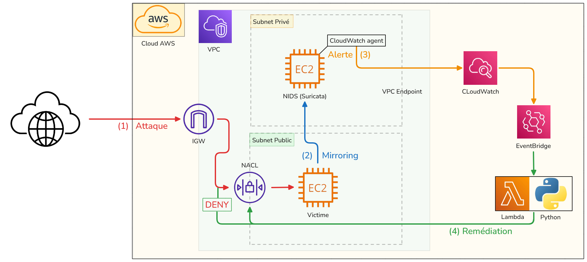

### Déroulement théorique d'une attaque et auto-remédiation :

1. **L'Attaque (Flux Rouge) :** Un attaquant tente une intrusion depuis Internet vers l'instance EC2 "Victime" exposée dans le Subnet Public.
2. **Le Mirroring (Flux Bleu) :** La fonctionnalité native *AWS VPC Traffic Mirroring* duplique ce trafic réseau et l'encapsule pour l'envoyer vers l'instance EC2 "NIDS" (hébergeant Suricata), isolée dans le Subnet Privé.
3. **L'Alerte (Flux Orange) :** Suricata identifie la signature de l'attaque. L'agent CloudWatch installé sur la machine lit ce log local et transmet l'alerte vers AWS CloudWatch Logs, ce qui déclenche une règle EventBridge.
4. **La Remédiation (Flux Vert) :** EventBridge invoque la fonction Lambda Python. Le script extrait l'IP source de l'attaquant depuis le log et effectue un appel API pour ajouter instantanément une règle de blocage (`DENY`) sur la NACL du Subnet Public. Le trafic de l'attaquant est coupé net.

## Développement & vérifications

### Connectivité de l'EC2 victime

On vérifie que l'EC2 victime possède bien une IPv4 publique, elle est output à la fin du `terraform apply` ici : 

```
output "victim_public_ip" {
  description = "L'adresse IP publique pour attaquer la victime"
  value       = aws_instance.ar_ec2_victim.public_ip
}
```

On peut alors s'y connecter via ssh et tester une commande ping vers l'extérieur. Cela montre que :

1. L'instance est accessible depuis l'extérieur en SSH (port 22)
2. L'instance dispose d'un accès à internet (ici `8.8.8.8`)


### Connectivité de l'EC2 NIDS

On configure exceptionellement une règle de security group sur l'EC2 NIDS autorisant les requêtes *ICMP* depuis le subnet publique. 

Lors de la création de l'EC2 NIDS, on visualise son adresse IPv4 (privée) : 

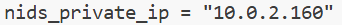

Puis, on la ping depuis l'EC2 victime

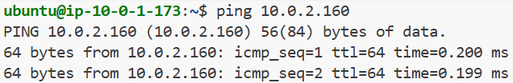

Cela fonctionne bien, on retire alors la règle autorisant les paquets ICMP sur l'EC2 NIDS. On laisse uniquement le port UDP 4789 ouvert, c'est celui que Suricata utilisera.

## Activation du NIDS

### Installation et configuration de Suricata

> La configuration est réalisée au travers du champ `user-data`.

L'EC2 NIDS accède à internet par le biais d'une NAT Gateway, avant de lancer une installation, on vérifie qu'elle a bien accès à internet : 

```sh
until ping -c1 8.8.8.8 &>/dev/null; do
    sleep 5
done
```

Une fois Suricata installé, il faut modifier les paramètres pour que l'écoute soit effectuée sur l'interface réseau exacte de l'EC2 (et non pas `eth0`). On obtient l'interface de l'EC2 de cette manière : 

```sh
MAIN_IFACE=$(ip route show default | awk '/default/ {print $$5}')
```

Puis on met à jour les fichiers de configuration :

```sh
sed -i "s/eth0/$${MAIN_IFACE}/g" /etc/suricata/suricata.yaml
```

Il ne reste plus qu'à mettre à jour puis activer le service : 

```sh
suricata-update
systemctl enable suricata
systemctl start suricata
```

### Configuration du mirroring

> Pour des raisons de simplicité (environnement de développement), on rend la [policy de l'user IAM](./ar-iam-user-terraform-policy.json) beaucoup plus permissive. 

On ajoute une règle au security group du NIDS afin qu'il puisse se faire administrer en SSH par la victime (à laquelle on se connecte en SSH)

Pour administrer le NIDS en passant par la victime, on utilise l'option `-J` de ssh :

```sh
ssh -J ubuntu@IP_VICTIME -i ~/.ssh/id_ed25519 ubuntu@IP_NIDS
```

### Vérification du fonctionnement du NIDS

Une fois connectés, on vérifie que le service tourne : 

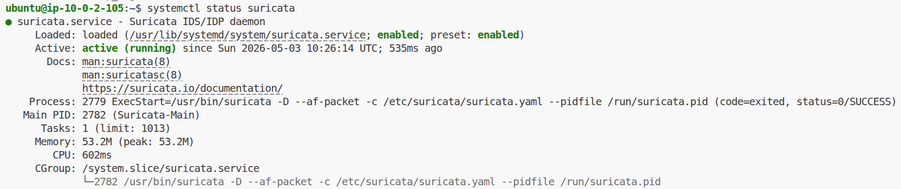

Je tente de me connecter au port ssh de la victime avec un appareil externe (attaquant) : 

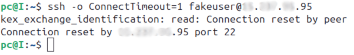

Suricata remonte bien l'attaque : 

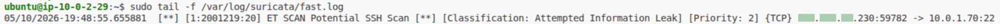

## Intégration de CloudWatch

On intègre l'agent CloudWatch dans le NIDS afin qu'il remonte les logs vers CloudWatch.

### Mise en place & configuration de l'agent

On attache un rôle à l'instance NIDS afin qu'elle puisse écrire dans CloudWatch. L'ARN du rôle est le suivant  `arn:aws:iam::aws:policy/CloudWatchAgentServerPolicy`.

Depuis le script user-data, on télécharge l'agent puis on le configure via le fichier `/opt/aws/amazon-cloudwatch-agent/etc/amazon-cloudwatch-agent.json` :

```json
{
  "agent": {
    "run_as_user": "root"
  },
  "logs": {
    "logs_collected": {
      "files": {
        "collect_list": [
          {
            "file_path": "/var/log/suricata/fast.log",
            "log_group_name": "/secops/suricata/alerts",
            "log_stream_name": "{instance_id}",
            "timezone": "UTC"
          }
        ]
      }
    }
  }
}
```

Cela copie alors tous les logs de suricata vers CloudWatch.


### Vérification

On cherche à nouveau à attaquer la machine victime, toujours en effectuant de la reconnaissance : 

- Tentatives de connexion ssh : `for i in {1..20}; do ssh -o ConnectTimeout=1 fakeuser@IP_PUBLIQUE & done`
- Scan Nmap : `nmap -p 22 -A IP_PUBLIQUE`

L'attaque est bien remontée dans CloudWatch :

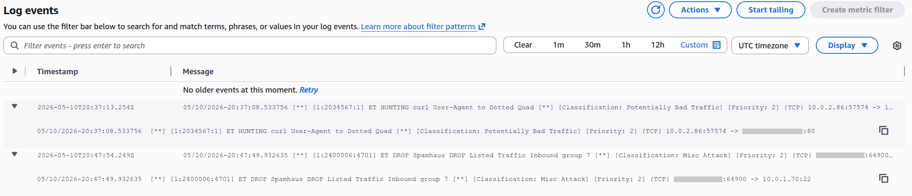

### Amélioration

Pour avoir plus d'informations, je choisi de monitorer le fichier `eve.json` qui contient plus d'informations et est plus complet que `fast.log`. Il remonte l'ip de l'attaquant et l'attaque tentée. Je l'affiche via l'onglet *Log analytics* de CloudWatch : 

```
SOURCE "arn:aws:logs:eu-west-3:***:log-group:/secops/suricata/eve" START=-3600s END=0s |
fields @timestamp, src_ip, dest_ip, alert.signature, alert.category
| filter event_type = "alert"
| sort @timestamp desc
| limit 50
```

Cela donne les alertes suivantes : 

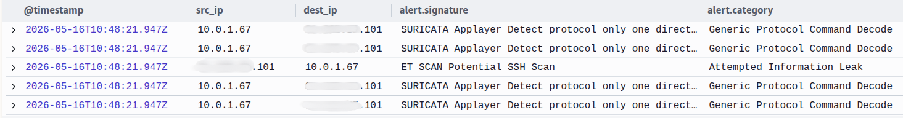

## Intégration Lambda

On fait souscrire la lambda au log group CloudWatch qui nous intéresse. On précise que le déclenchement doit faire suite à un event-type égal à `alert`. Il y a une protection pour ne pas bloquer les IPs utilisées dans le dispositif deployé sur AWS. Le code détaillé de cette fonction lambda est situé dans le fichier [lambda_function.py](./src/lambda_function.py).

La fonction a les rôles suffisants pour modifier la NACL passée par variable d'environnement de manière à bloquer indéfiniment l'IP de l'attaquant.

# Déroulement d'une attaque

### Mise en place du logging

Un nouveau log group est crée dans CloudWatch. Elle contient les logs 

### Reconnaissance

L'attaquant est capable de faire un ping sur la machine victime

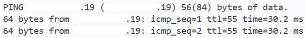

On a aussitôt l'information dans le log group qu'une reqûete ICMP de type 8 (echo) a été effectuée 

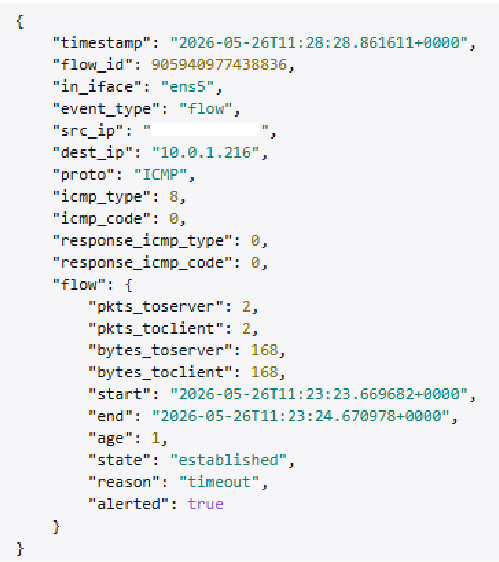

### Simulation d'attaque

On simule une attaque par brute force depuis la machine attaquant : 

```sh
nmap -p 22 -sV -sC -A*.*.*.19
```

### Remédiation automatique

L'attaque SSH a été directement détectée par Suricata, envoyée à la fonction Lambda qui a modifé la NACL pour bannir l'IP de l'attaquant.

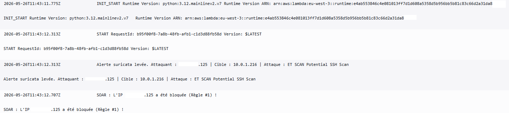

### Blocage de l'attaquant

Le SSH est inaccessible

```sh
ssh: connect to host *.*.*.19 port 22: Connection timed out
```

De plus, la victime n'est plus atteignable avec la commande ping. Tout le traffic provenant de cette ip a bien été bloqué (Protocole `-1`).

```sh
$ ping -c 4 *.*.*.19
PING *.*.*.19 (*.*.*.19) 56(84) bytes of data.

--- *.*.*.19 ping statistics ---
4 packets transmitted, 0 received, 100% packet loss, time 3079ms
```

