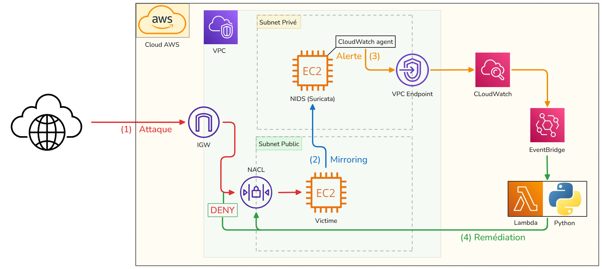
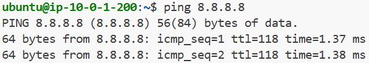

# Auto-Remédiation d'Intrusions (NIDS to NACL)

> **Statut :** Ce projet est actuellement en cours de développement (Work in Progress)...

## Présentation du Projet

Ce projet est une implémentation pratique d'une architecture **SOAR (Security Orchestration, Automation, and Response)** sur AWS. Son objectif est de détecter des activités réseau malveillantes en temps réel (scans de ports, brute force). Cela dans le but de bloquer automatiquement l'attaquant au niveau de la couche réseau. On modifie alors la **NACL (Network Access Control List)** sans aucune intervention humaine.

L'infrastructure sera entièrement gérée sous forme de code (**IaC**) avec **Terraform** et s'appuie sur le moteur de détection d'intrusion open-source **Suricata**, déployé de manière sécurisée dans un sous-réseau privé.

**Principales caractéristiques techniques :**
- Utilisation du **VPC Traffic Mirroring** pour analyser le trafic réseau de manière asynchrone, sans impacter les performances de l'instance ciblée (qui joue le rôle de la victime).
- Pipeline de journalisation et d'alerte **serverless** via **CloudWatch Agent** et **EventBridge**.
- Scripting d'auto-remédiation via **AWS Lambda (Python 3 / Boto3)** pour modifier dynamiquement les règles de la **NACL (Network Access Control List)**.

---

## Architecture et Workflow

Le diagramme ci-dessous illustre l'architecture réseau (répartition en sous-réseaux public/privé) et le cycle de vie complet d'un incident de sécurité, de la détection à la remédiation.



### Déroulement théorique d'une attaque et auto-remédiation :

1. **L'Attaque (Flux Rouge) :** Un attaquant tente une intrusion depuis Internet vers l'instance EC2 "Victime" exposée dans le Subnet Public.
2. **Le Mirroring (Flux Bleu) :** La fonctionnalité native *AWS VPC Traffic Mirroring* duplique ce trafic réseau et l'encapsule pour l'envoyer vers l'instance EC2 "NIDS" (hébergeant Suricata), isolée dans le Subnet Privé.
3. **L'Alerte (Flux Orange) :** Suricata identifie la signature de l'attaque. L'agent CloudWatch installé sur la machine lit ce log local et transmet l'alerte vers AWS CloudWatch Logs, ce qui déclenche une règle EventBridge.
4. **La Remédiation (Flux Vert) :** EventBridge invoque la fonction Lambda Python. Le script extrait l'IP source de l'attaquant depuis le log et effectue un appel API pour ajouter instantanément une règle de blocage (`DENY`) sur la NACL du Subnet Public. Le trafic de l'attaquant est coupé net.

## Développement & vérifications

### Connectivité de l'EC2 victime

On vérifie que l'EC2 victime possède bien une IPv4 publique, elle est output à la fin du `terraform apply` ici : 

```
output "victim_public_ip" {
  description = "L'adresse IP publique pour attaquer la victime"
  value       = aws_instance.ar_ec2_victim.public_ip
}
```

On peut alors s'y connecter via ssh et tester une commande ping vers l'extérieur. Cela montre que :

1. L'instance est accessible depuis l'extérieur en SSH (port 22)
2. L'instance dispose d'un accès à internet (ici `8.8.8.8`)

